## GP Booking System (Doctor)

---

## Description
The Doctor Booking System is designed to facilitate seamless interactions between doctors and patients, with the potential inclusion of a third party. <br>
The system primarily enables doctors to manage patient bookings efficiently, allowing patients to view, modify, and address any inquiries regarding their appointments.
By granting doctors direct control over scheduling, the system ensures a more secure and optimized process, reducing patient stress and providing a reliable, hassle-free experience where they can trust their doctor to handle the entire booking process.

## Project status
Finished

### Sprint 1:
• Created a database to store user's login details and booking details.

• Created a system to allow a doctor to view their bookings by entering a month and year.

• Created a login page for users to login.

### Sprint 2:
• Created a table to store patient's information in the database.

• Created a Welcome Page for user to use different functions after login.

• Created a Visit Details System for the user to view past booking details.

• Created a Doctor Visit Entry System for the user to edit details for past bookings.

• Created a Patients Information Page for the user to view the patient's information.

## Visuals

#### Screenshots
Below are some screenshots of the project in action: <br>
This includes our Database and all the functions of what we have done till sprint 2. 

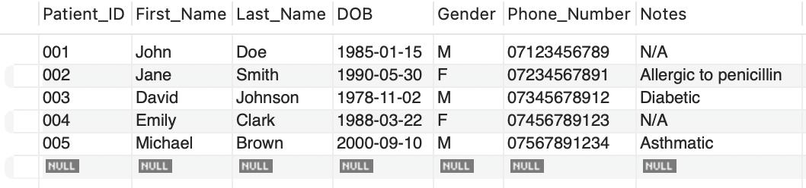

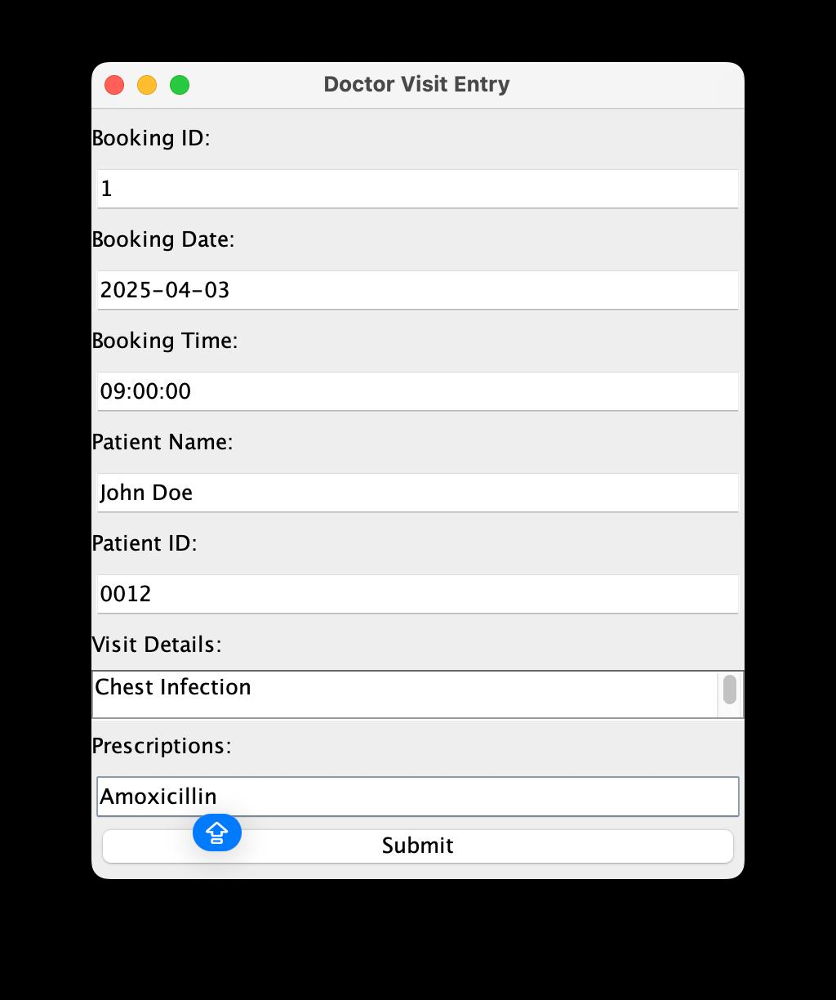

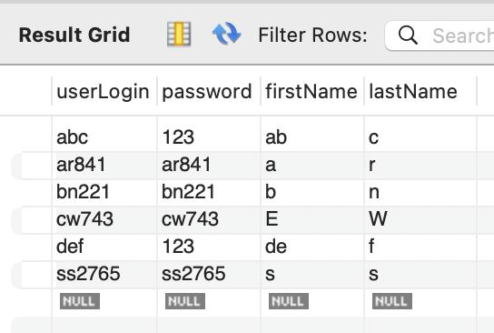  

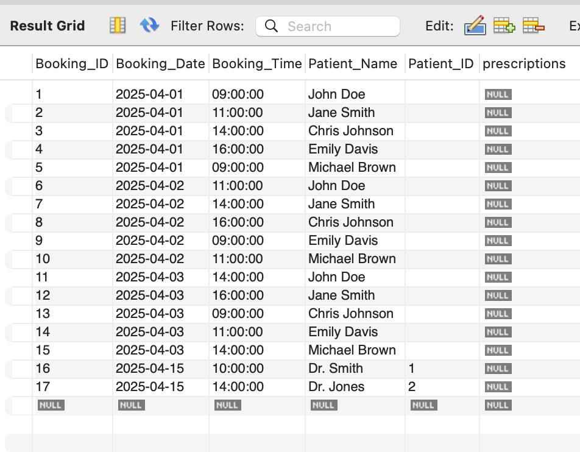  

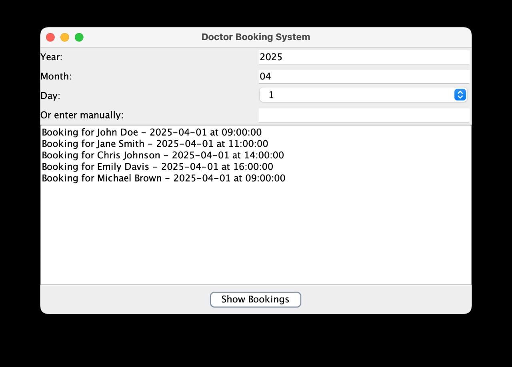  

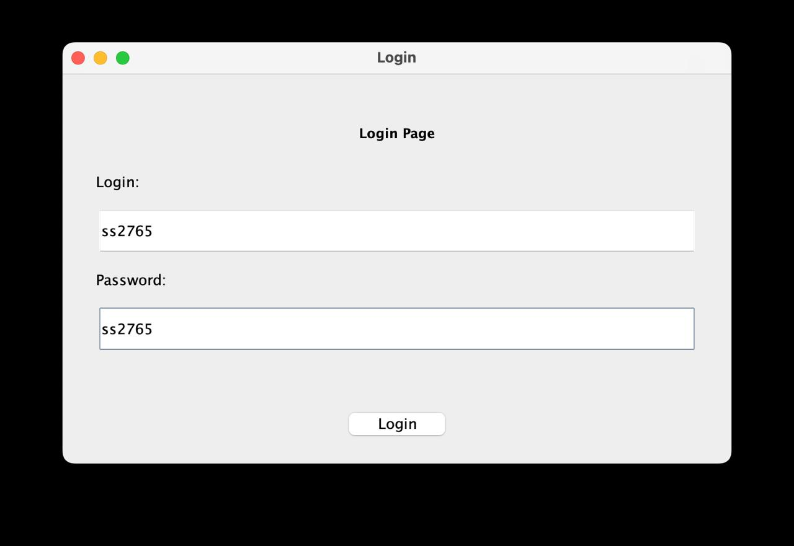  

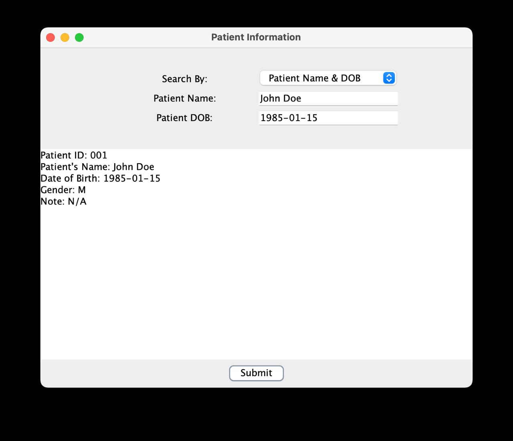 

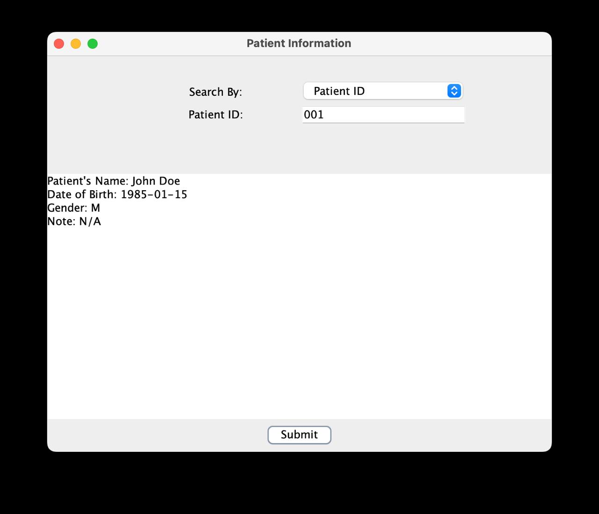  

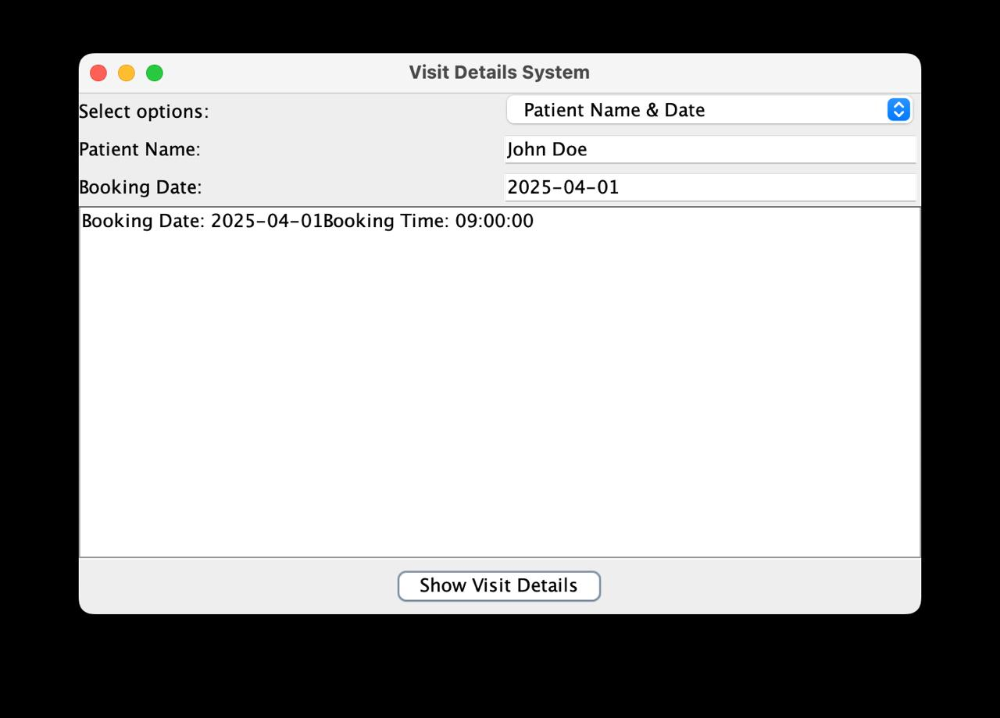  

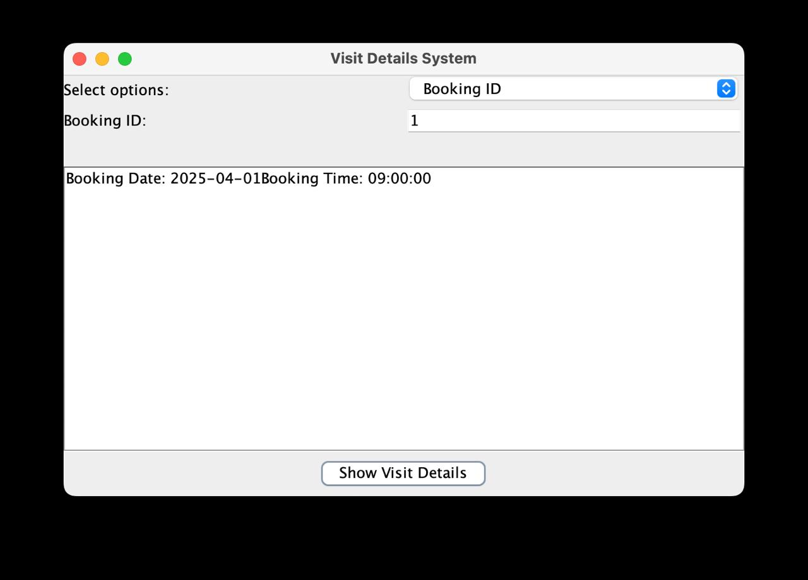

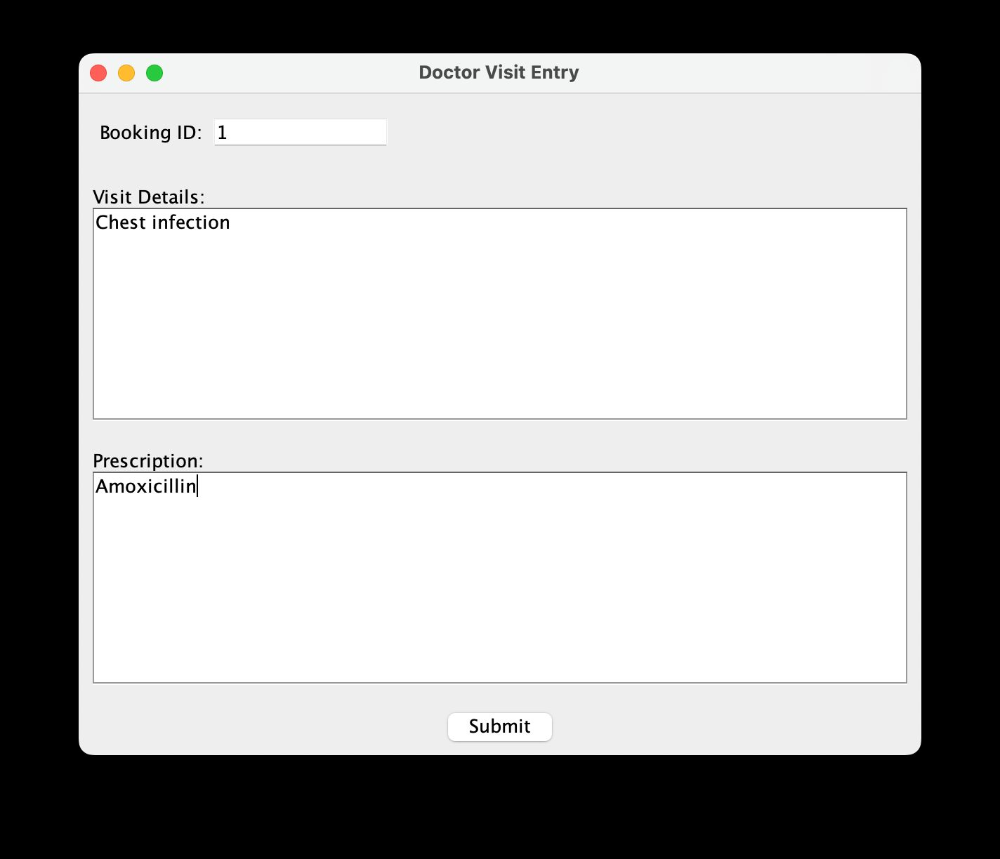

## Usage & Installation
First, we had to make sure that everyone had IntelliJ as our IDE specially considering the fact that we all had different operating systems. But additionally,
These are the lists of things that were manually added by us:
* New Directories
* New Text Files
* Git Installment via Access Token that we got on git.cs.kent.ac.uk Under (User Profile). Its only accessible for those doing the project, and requires few manual steps such as creating a new Token First.
* Under Version Control we then put the URL https://git.cs.kent.ac.uk/ in it 
* This is where the Access Token is to be put, this then allows you to access the project that the group has been working on.
* We also had to manually install Maven which we did from the website itself, we then followed a set of instructions to make some of the errors that we had work. But it was mainly the import issues which it fixed immediately.
* MYSQL WorkBench for Database Management.
* Manually Selected Git as a Plugin
  
---
## Roadmap
Enhancing the security of the database, improving the visual appeal of the website, and optimizing its functionalities for greater efficiency are key priorities for ensuring a robust, user-friendly, and high-performing system. <br>
Strengthening security measures will safeguard sensitive data, while a modern and aesthetically pleasing design will enhance user experience. Additionally, refining functionalities will improve overall system performance, making interactions smoother and more seamless for users. 
By focusing on these three aspects—security, design, and efficiency—the system can deliver a secure, visually engaging, and highly functional experience for all users.

## Contributing
State if you are open to contributions and what your requirements are for accepting them.

For people who want to make changes to your project, it's helpful to have some documentation on how to get started. Perhaps there is a script that they should run or some environment variables that they need to set. Make these steps explicit. These instructions could also be useful to your future self.

You can also document commands to lint the code or run tests. These steps help to ensure high code quality and reduce the likelihood that the changes inadvertently break something. Having instructions for running tests is especially helpful if it requires external setup, such as starting a Selenium server for testing in a browser.

## Authors and acknowledgment
* <b> Siddhant Shrestha </b> - Project Leader & Backend Developer <br>
* <b> Edan Wong </b> - Database Designer & Administrator <br>
* <b> Alfred Rich </b> - Frontend Developer & UI/UX Designer <br>
* <b> Benjamin Nneji </b> - Tester 

## License
For open source projects, say how it is licensed.

## Badges
In progress

---
## Getting started

To make it easy for you to get started with GitLab, here's a list of recommended next steps.

Already a pro? Just edit this README.md and make it your own. Want to make it easy? [Use the template at the bottom](#editing-this-readme)!

## Add your files

- [ ] [Create](https://docs.gitlab.com/ee/user/project/repository/web_editor.html#create-a-file) or [upload](https://docs.gitlab.com/ee/user/project/repository/web_editor.html#upload-a-file) files
- [ ] [Add files using the command line](https://docs.gitlab.com/ee/gitlab-basics/add-file.html#add-a-file-using-the-command-line) or push an existing Git repository with the following command:

```
cd existing_repo
git remote add origin https://git.cs.kent.ac.uk/cw743/comp5590-g16d-a2.git
git branch -M main
git push -uf origin main
```

## Integrate with your tools

- [ ] [Set up project integrations](https://git.cs.kent.ac.uk/cw743/comp5590-g16d-a2/-/settings/integrations)

## Collaborate with your team

- [ ] [Invite team members and collaborators](https://docs.gitlab.com/ee/user/project/members/)
- [ ] [Create a new merge request](https://docs.gitlab.com/ee/user/project/merge_requests/creating_merge_requests.html)
- [ ] [Automatically close issues from merge requests](https://docs.gitlab.com/ee/user/project/issues/managing_issues.html#closing-issues-automatically)
- [ ] [Enable merge request approvals](https://docs.gitlab.com/ee/user/project/merge_requests/approvals/)
- [ ] [Set auto-merge](https://docs.gitlab.com/ee/user/project/merge_requests/merge_when_pipeline_succeeds.html)

## Test and Deploy

Use the built-in continuous integration in GitLab.

- [ ] [Get started with GitLab CI/CD](https://docs.gitlab.com/ee/ci/quick_start/index.html)
- [ ] [Analyze your code for known vulnerabilities with Static Application Security Testing (SAST)](https://docs.gitlab.com/ee/user/application_security/sast/)
- [ ] [Deploy to Kubernetes, Amazon EC2, or Amazon ECS using Auto Deploy](https://docs.gitlab.com/ee/topics/autodevops/requirements.html)
- [ ] [Use pull-based deployments for improved Kubernetes management](https://docs.gitlab.com/ee/user/clusters/agent/)
- [ ] [Set up protected environments](https://docs.gitlab.com/ee/ci/environments/protected_environments.html)

***

